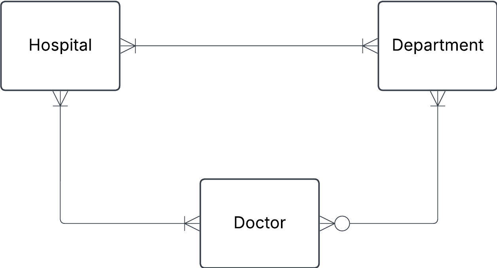
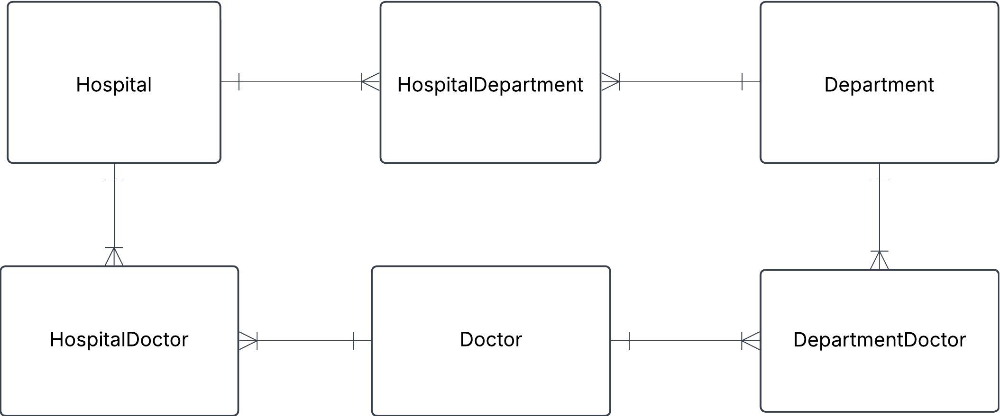

## 1. Hospital Task

Manually convert JSON data in to three tables: hospital, department and doctor.

```json
{
  "hospital": "Sjukhusstock",
  "address": "Drottninggatan 3, Stockholm",
  "departments": [
    {
      "name": "Kardiologi",
      "doctors": [
        { "id": 1, "name": "Dr. Abra Abrahamson" },
        { "id": 2, "name": "Dr. Erika Eriksson" }
      ]
    },
    {
      "name": "Neurologi",
      "doctors": [{ "id": 3, "name": "Dr. Sven Svensson" }]
    }
  ]
}
```

## Solution

- identify entities
- identify relationships and cardinalities
- create conceptual ERD
- create tables



###

Hospital

| hospital_id | name         | address          |
| ----------- | ------------ | ---------------- |
| 1           | Sjukhusstock | Drottninggatan 3 |

Department

| department_id | name       |
| ------------- | ---------- |
| 1             | Kardiologi |
| 2             | Neurologi  |

Doctor

| doctor_id | name                |
| --------- | ------------------- |
| 1         | Dr. Abra Abrahamson |
| 2         | Dr. Erika Eriksson  |
| 3         | Dr. Sven Svensson   |



###

HospitalDepartment

| hospital_department_id | hospital_id | department_id |
| ---------------------- | ----------- | ------------- |
| 1                      | 1           | 1             |
| 2                      | 1           | 2             |

HospitalDoctor

| hospital_doctor_id | hospital_id | doctor_id |
| ------------------ | ----------- | --------- |
| 1                  | 1           | 1         |
| 2                  | 1           | 2         |
| 3                  | 1           | 3         |

DepartmentDoctor

| department_doctor_id | department_id | doctor_id |
| -------------------- | ------------- | --------- |
| 1                    | 1             | 1         |
| 2                    | 1             | 2         |
| 3                    | 2             | 3         |

### Query information on Sjukhusstock and its departments

```SQL
SELECT h.name AS hospital_name, d.name AS department_name
FROM hospital h
JOIN hospital_department hd USING(hospital_id)
JOIN department d USING(department_id)
WHERE h.name = "Sjukhusstock";
```
