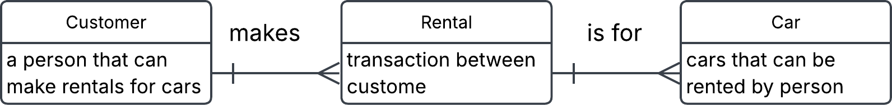

## 3. Conceptual ERD to words

This is an ERD conceptual diagram that a database designer and the business stakeholders agreed upon in a car rental company called Carent.

 

a) Describe the entities in this conceptual ERD.

- Customer is a person that can make rentals for cars.
- Car is the cars that can be rented by person
- Rental (composite entity) is a transaction between customers and cars

 

b) Write out the relationship labels.
See image above

c) Describe the relationships between the entities (one-to-many, one-to-one and many-to-many).

- Customer to rental ( one-to-many)
- Rental to Customer (many-to-one)
- Rental to Car (many-to-one)
- Car to Rental (on-to-many)

d) Define the relationship statement for example: "A Customer can have one or more Rentals".

- A Customer makes one or more Rentals over time
- Each Rental is connected to one Customer
- Each Rental is for one Car
- Each Car can be in several Rentals
