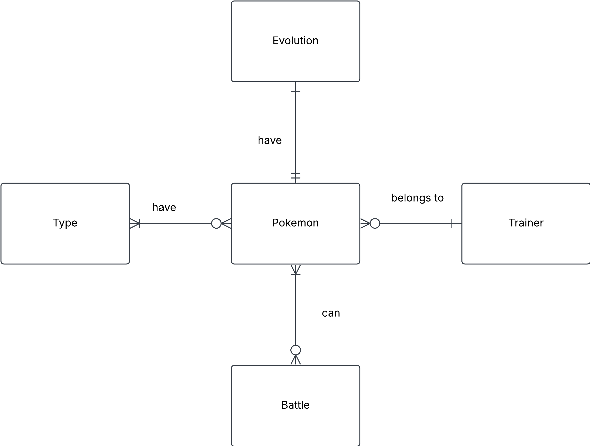

## Design a conceptual ER model based on the following information:

- Each Pokémon has a name, Pokédex number, type(s) (e.g., Fire, Water), base stats (HP, Attack, Defense, etc.), and an evolution stage.
- Each Pokémon can belong to multiple types (e.g., Charizard is Fire/Flying).
- Each Pokémon belongs to a trainer.
- A Trainer has an ID, name, and hometown.
- A Pokémon can battle another Pokémon, and the battle has a winner.
- Some Pokémon evolve into another Pokémon.

 

